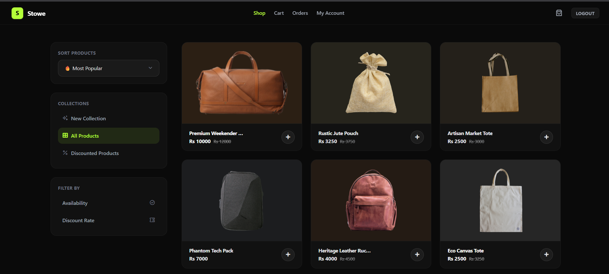

<div align="center">

# 🛍️ Stowe — Premium Bag Store

**A full-stack e-commerce platform for bags, built with Node.js, Express, MongoDB, and EJS.** Browse, shop, and manage a complete online store — from product catalog to checkout to admin dashboard.

[](https://nodejs.org)
[](https://www.mongodb.com/atlas)
[](https://tailwindcss.com)
[](https://ejs.co)

</div>

---

## 📸 Preview

> *Dark-themed storefront with lime accents — product browsing, cart, and checkout*



---

## ✨ Features

- 🔐 **User authentication** — secure registration & login with JWT and bcrypt password hashing
- 🛒 **Shopping cart** — add, remove, and adjust item quantities with live stock validation
- 📦 **Product catalog** — sort by newest, most popular, or highest discount; filter by new arrivals, discounts, or availability
- 📊 **Inventory management** — automatic stock deduction on checkout, out-of-stock indicators on product cards
- 🧾 **Order history** — every checkout creates an order record viewable in the user's account
- 👤 **User profiles** — editable account page with custom profile picture upload
- 🛠️ **Owner dashboard** — protected admin panel to view store stats, manage products, and add new listings
- 🚦 **Flash messaging** — site-wide success/error notifications with smooth slide animations
- 🌑 **Custom dark UI** — Tailwind-based design with a signature black & lime (`#b4ff39`) brand palette
- 📱 **Fully responsive** — mobile-first layout across shop, cart, and account pages

---

## 🚀 Live Demo

**[→ View Stowe](#)** *(coming soon)*

---

## 🗂️ Project Structure

```text
Stowe/
│
├── config/
│   ├── mongoose-connection.js     # MongoDB connection setup
│   ├── multer.js                  # Disk storage config (profile pictures)
│   └── productMulter.js           # Memory storage config (product images)
│
├── controllers/
│   ├── cartController.js          # Cart, checkout, and order logic
│   ├── ownerController.js         # Owner dashboard & auth logic
│   ├── productController.js       # Product listing, sort & filter logic
│   └── userController.js          # User auth & account logic
│
├── middleware/
│   ├── IsLoggedIn.js               # Protects user-only routes
│   ├── isOwnerLoggedIn.js          # Protects owner-only routes
│   └── redirectIfAuthenticated.js  # Redirects logged-in users from login page
│
├── models/
│   ├── order-model.js
│   ├── owner-model.js
│   ├── product-model.js
│   └── user-model.js
│
├── public/
│   ├── css/
│   └── images/uploads/             # User-uploaded profile pictures
│
├── routes/
│   ├── cartRouter.js
│   ├── ownersRouter.js
│   ├── productsRouter.js
│   └── usersRouter.js
│
├── utils/
│   └── generatetoken.js            # JWT generation
│
├── views/
│   ├── partials/                   # Shared navbar & flash message components
│   ├── index.ejs                   # Login / Register page
│   ├── shop.ejs                    # Product catalog
│   ├── cart.ejs                    # Shopping cart
│   ├── account.ejs                 # User profile
│   ├── orders.ejs                  # Order history
│   ├── owner-dashboard.ejs         # Admin dashboard
│   ├── owner-login.ejs             # Admin login
│   ├── createproducts.ejs          # Add new product form
│   └── 404.ejs                     # Custom not-found page
│
├── app.js                          # Express app entry point
└── package.json
```

---

## 🏁 Getting Started

```bash
# 1. Clone the repository
git clone https://github.com/Samiullah-2004/Stowe.git

# 2. Navigate into the project
cd Stowe

# 3. Install dependencies
npm install

# 4. Set up environment variables
# Create a .env file with:
#   JWT_KEY=your_random_secret
#   EXPRESS_SESSION_SECRET=your_random_secret

# 5. Configure your database
# Copy config/development.json.example to config/development.json
# and add your MongoDB connection string

# 6. Run the server
node app.js
```

Then open [http://localhost:3000](http://localhost:3000) in your browser.

---

## 🛠️ Tech Stack

| Technology | Purpose |
|---|---|
| **Express.js** | Backend framework & routing |
| **MongoDB + Mongoose** | Database & schema modeling |
| **EJS** | Server-side templating |
| **Tailwind CSS** | Utility-first styling |
| **JWT + bcrypt** | Authentication & password security |
| **Multer** | File uploads (product images & avatars) |
| **connect-flash** | Flash messaging for user feedback |

---

## 🚢 Deployment

This site is deployed on **Render**, with **MongoDB Atlas** as the cloud database.

Environment variables required on the host:
- `JWT_KEY`
- `EXPRESS_SESSION_SECRET`
- `MONGODB_URI`
- `NODE_ENV=production`

---

## 👤 Author

**Samiullah Akram**  
Frontend Developer from Lahore, Pakistan 🇵🇰

[](https://github.com/Samiullah-2004)
[](https://www.linkedin.com/in/samiullah-akram-a28461404/)
[](https://instagram.com/_s_a_m_i_u_l_l_a_h_)
[](mailto:samiullah.akram.3009@gmail.com)

---

## 📄 License

This project is open source and free to use for personal and educational purposes.  
If you use this as a reference or template, a credit would be appreciated! 🙏

---

<div align="center">

**Built with 💚 by Samiullah — 2026**

</div>
